# Pluck VM Solution

- **Operating System:** Ubuntu
- **Machine Name:** Pluck

### Analysis:
1. **Performed netdiscover scan to discover the machine’s IP.**

   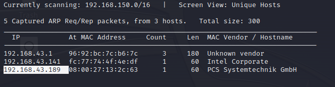

2. **Performed a basic Nmap scan to see active ports.**

   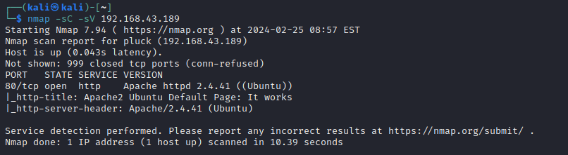

3. **HTTP port is open, so I opened the page on my browser.**

   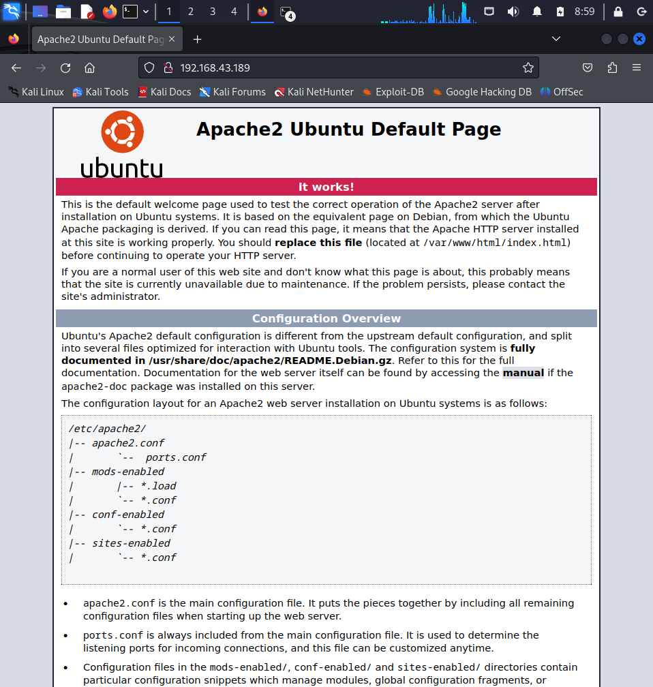

   I found nothing of interest in the source code, so I continued to dig deeper.

4. **Performed a basic directory enumeration using Gobuster with the `big.txt` wordlist.**

   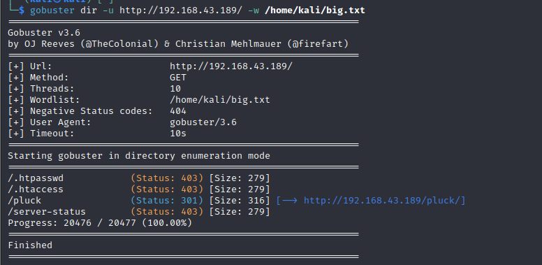

   I found a directory named `/pluck`.

5. **Opened the `/pluck` directory in the browser.**

   

6. **Found a login page on `/pluck` that requires a password, which we do not have.**

   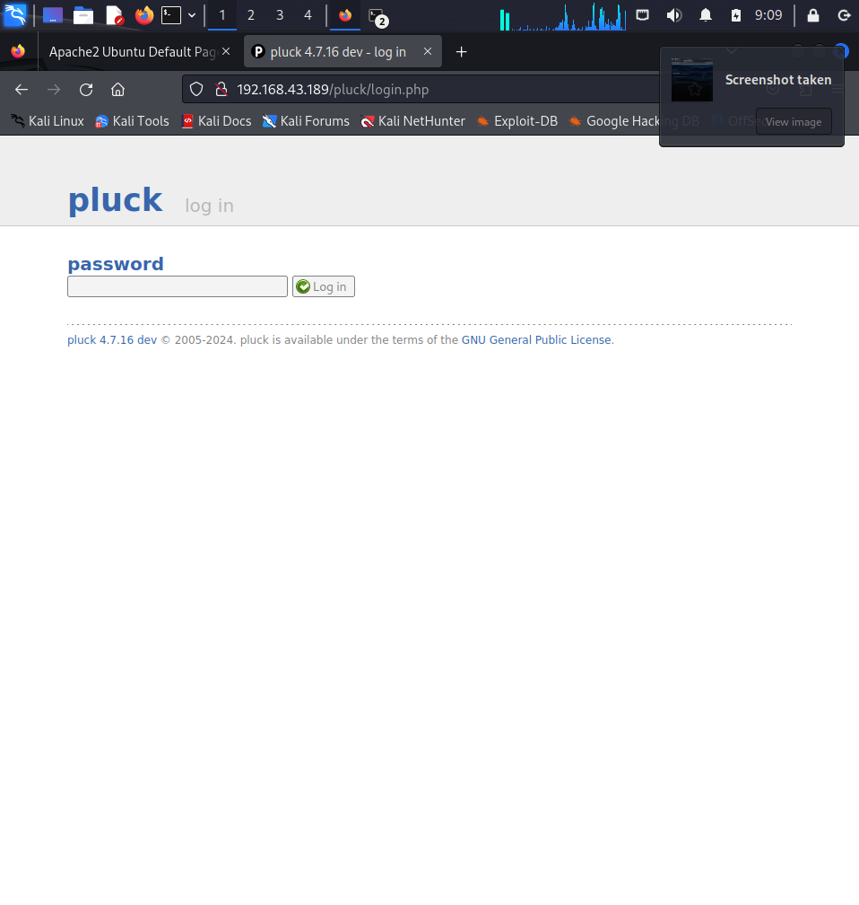

7. **Performed a directory enumeration using `dirb` on Kali Linux.**

   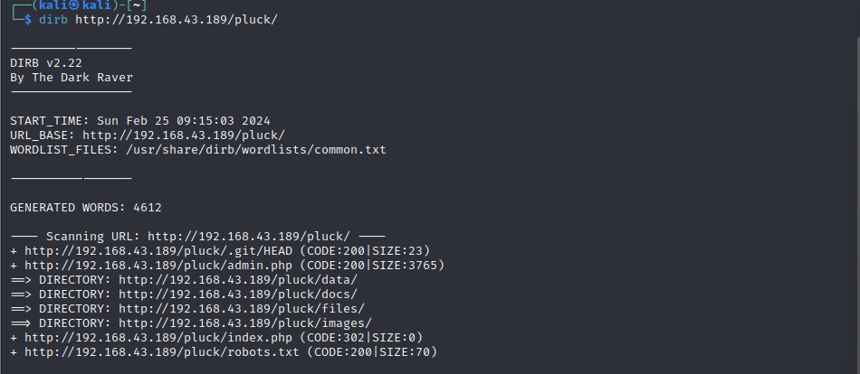

8. **Found some promising directories to investigate.**

   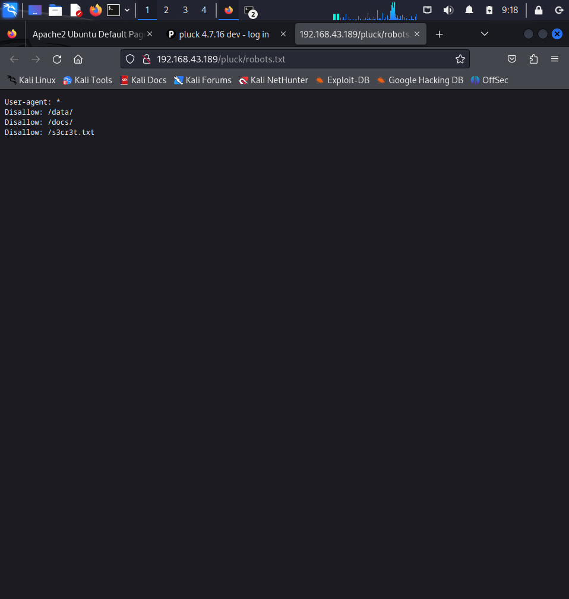

9. **Opened the `robots.txt` file and found an interesting file named `/s3cr3t.txt`. I opened that directory.**

   

10. **Used the login info from `/s3cr3t.txt` to sign in on `/login.php`.**

    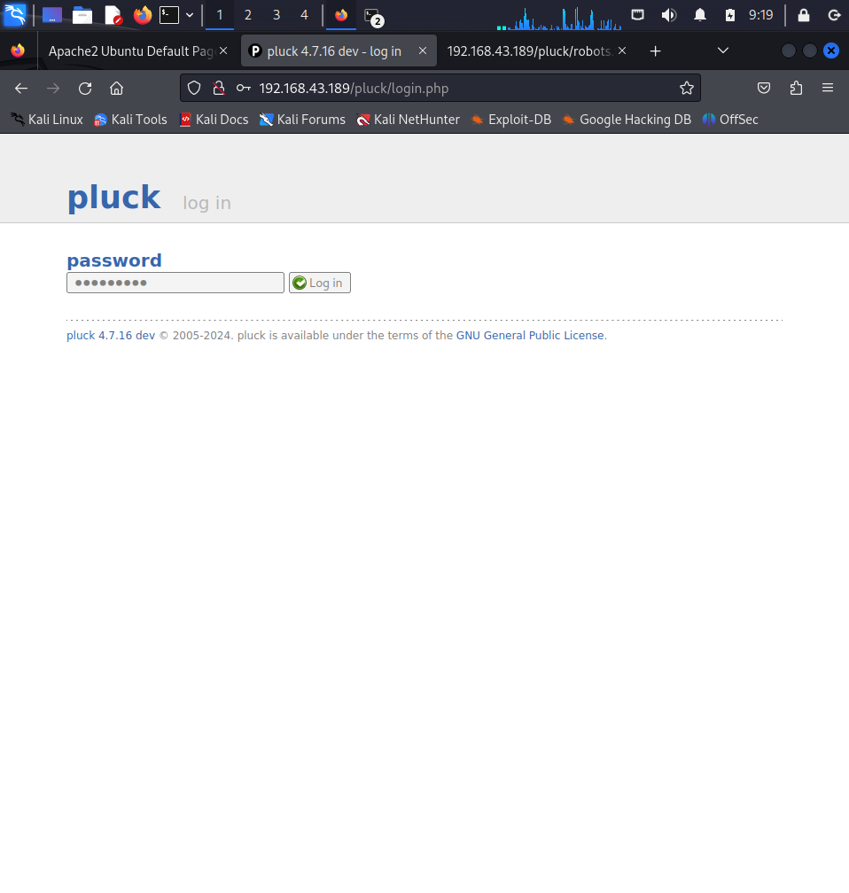
    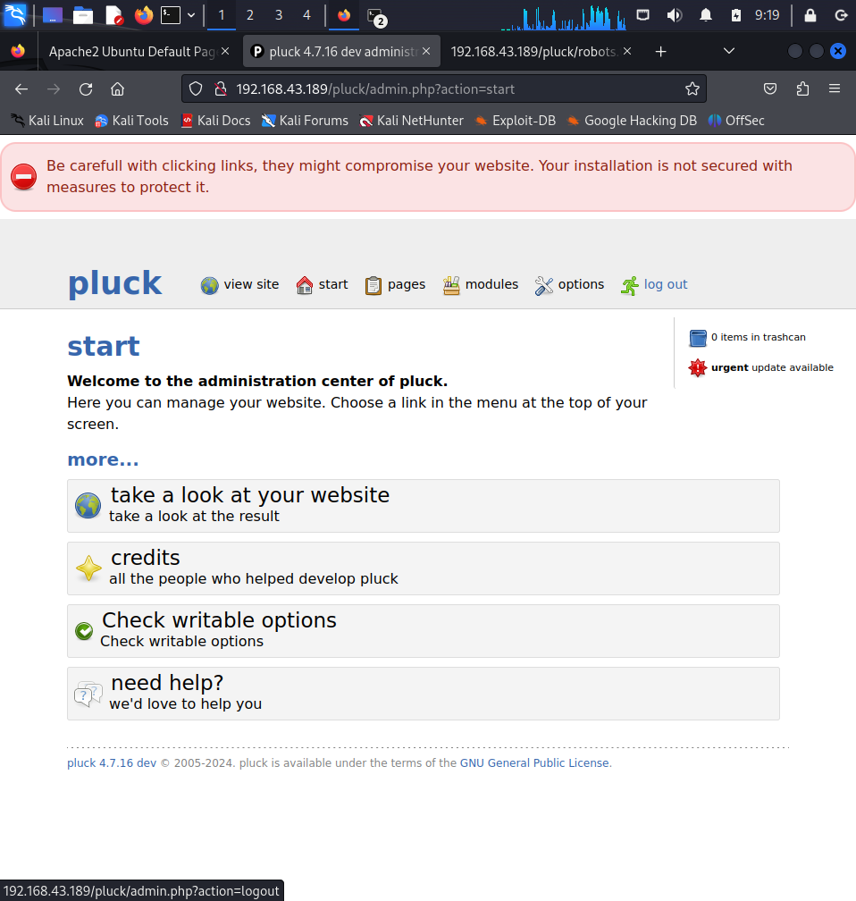

    Unfortunately, there was nothing of interest, but I discovered that Pluck 4.7.16 is vulnerable to Local File Injection.

11. **Pluck 4.7.16 Exploit — [Exploit-DB Link](https://www.exploit-db.com/exploits/50826)**

    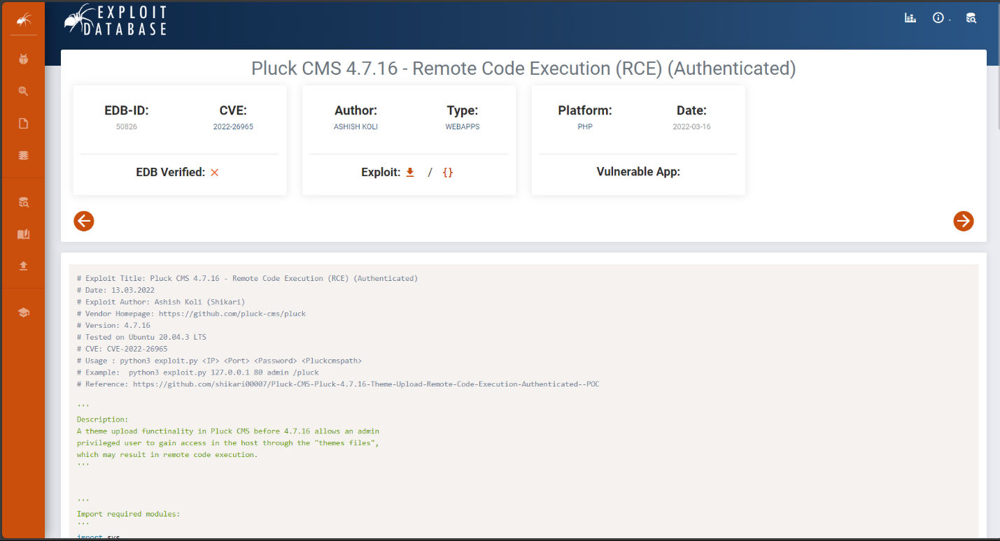

12. **Used the vulnerability to inject a reverse shell into the machine.**

13. **Downloaded `rev_shell.py` and `shell.tar` from [Cyberw1ng’s Bug Bounty GitHub repository](https://github.com/Cyberw1ng/Bug-Bounty).**

    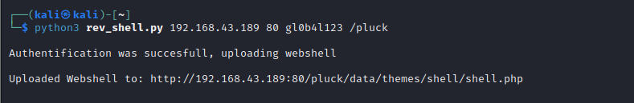

14. **Executed a command on the web shell.**

    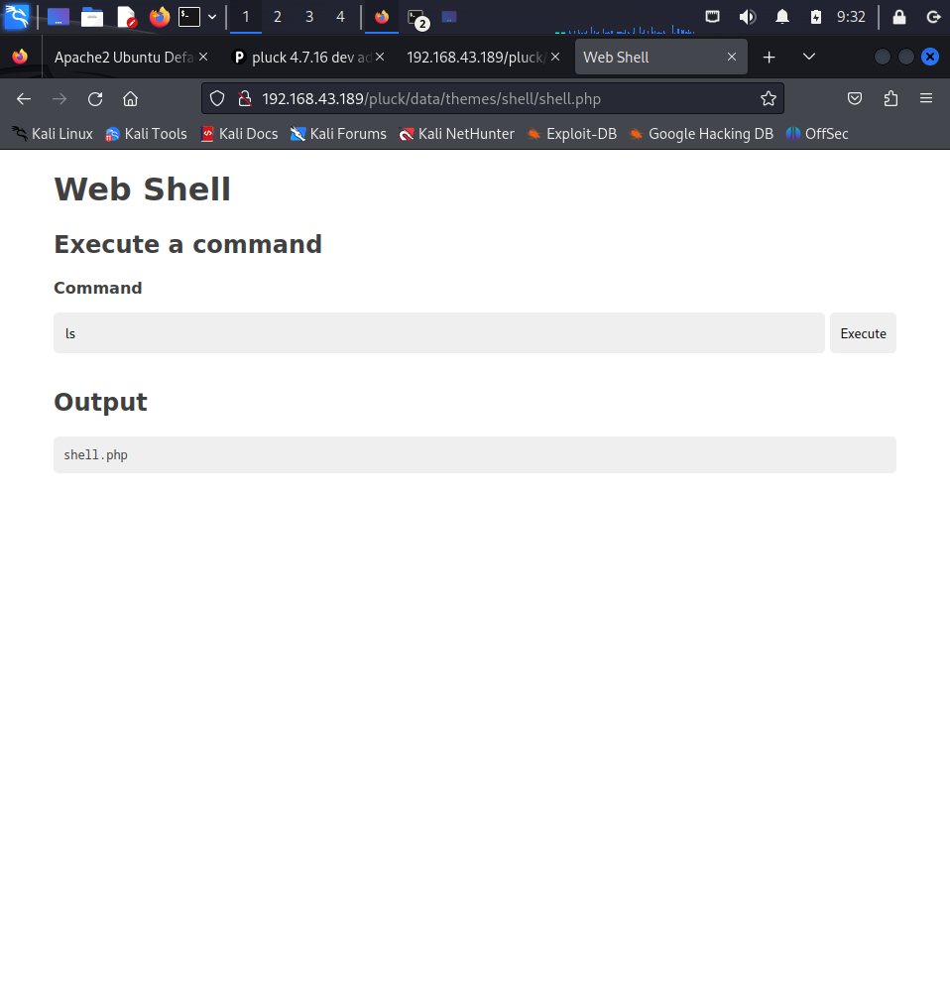

15. **Set up a netcat listener on port 2929.**

    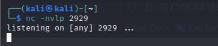

16. **Used the reverse shell command on the web shell.**

    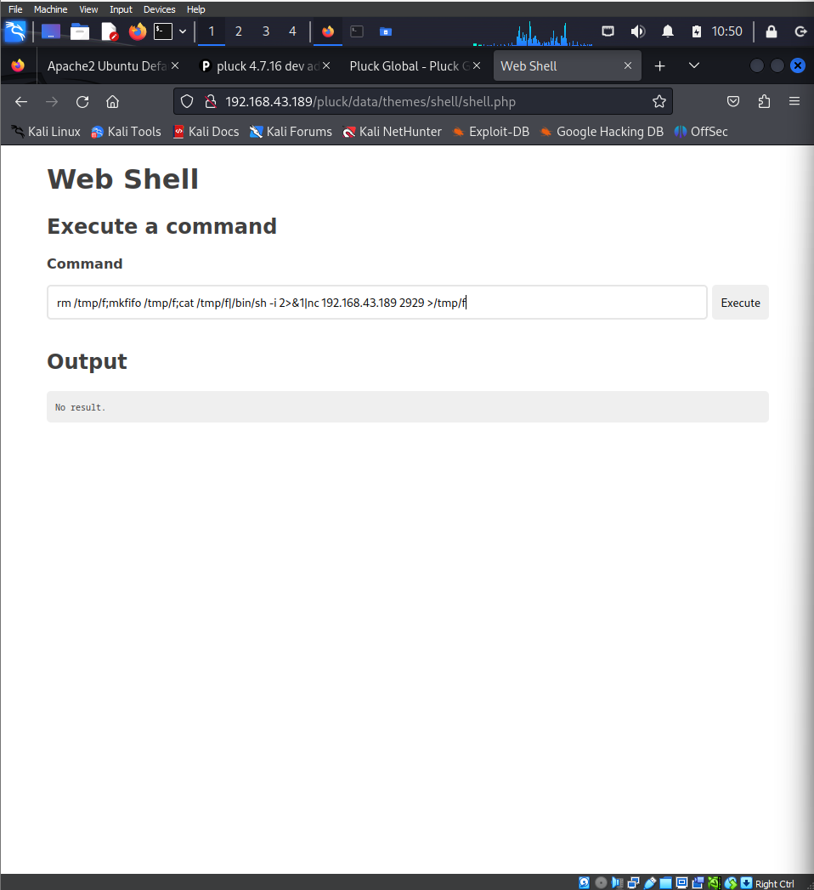
    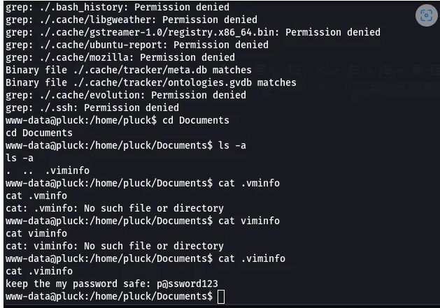
    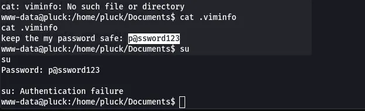
    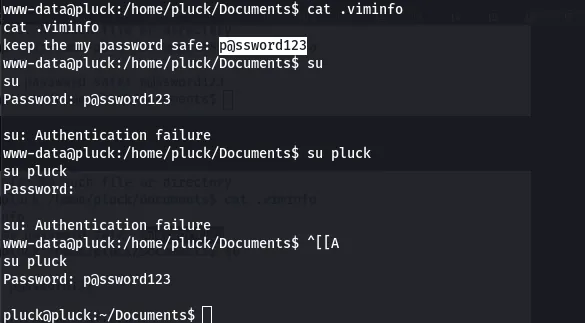
    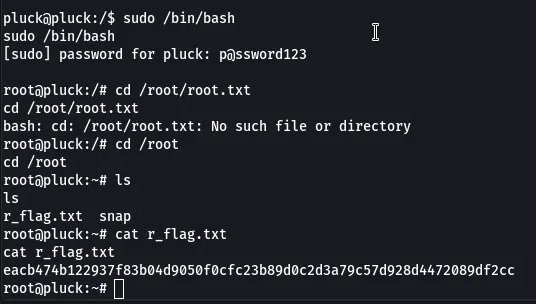

**Root Flag:** `eacb474b122937f83b04d9050f0cfc23b89d0c2d3a79c57d928d4472089df2cc`
